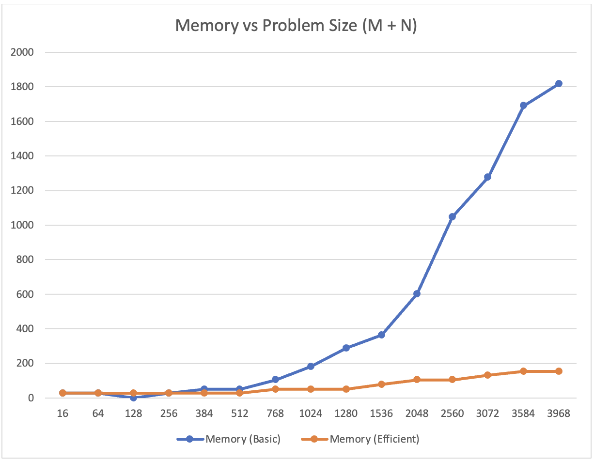
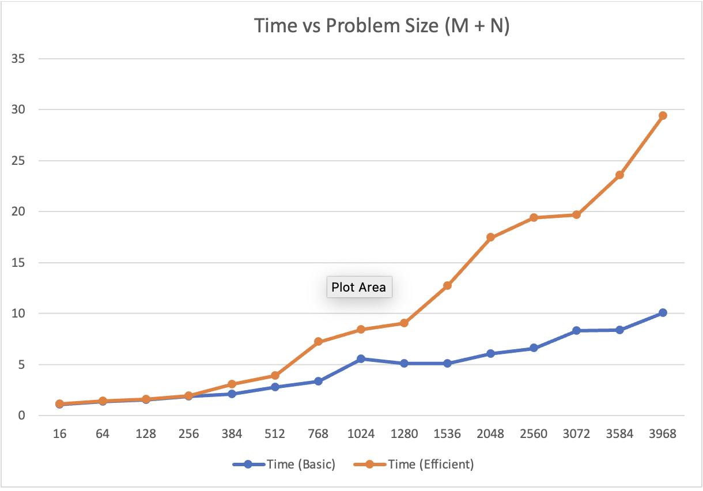

# Sequence Alignment Problem

## CSCI 570 - Analysis of Algorithms (USC)

### Problem Statement:

Implement the basic and memory efficient Dynamic Programming solution to the Sequence Alignment problem. Run the test set provided and show your results.
The complete problem statement can be found [here](https://github.com/anushka-deshpande/CSCI570-project/blob/main/CSCI570_Fall22_Project.pdf).

### Results:

This project compares the two versions of the sequence alignment problem – the basic version and the efficient version. After running both the algorithms, we obtained data based on both of their performances and compared them using line graphs as discussed below. 

Using the provided input files, datapoints were generated to plot the following graphs:
1. Single plot of CPU time vs problem size for the two solutions.
2. Single plot of Memory usage vs problem size for the two solutions.

These were plotted and results were obtained as follows:

Graph 1 - Memory vs Problem Size (M+N)

Nature of the Graph:  
Basic: O(n^2) - Polynomial  
Efficient: O(n) - Linear  

Graph 2 - Time vs Problem Size (M+N)

Nature of the Graph:  
Basic: O(n^2) - Polynomial  
Efficient: O(n) - Polynomial  

According to the graphs, it can be seen that the basic version requires much more memory as compared to the efficient version. This is because an array of size n^2 is created for the basic version, which can have a high cost when the problem size if high. 

On the other hand, it is also clearly visible that the basic version takes less time as compared to the efficient version as the problem size increases. The reason behind this trend is that we are calculating the OPT array repeatedly for the efficient version instead of storing it. Below is a more detailed description of the two graphs. 

